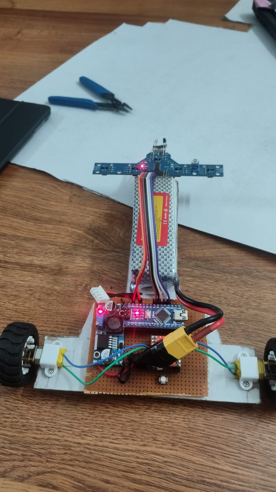
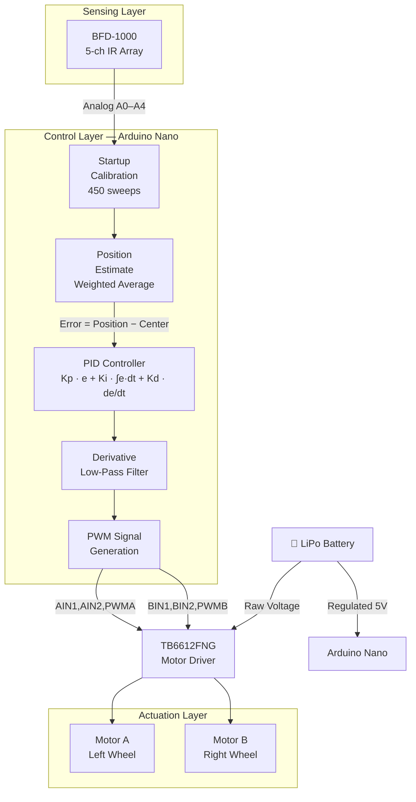
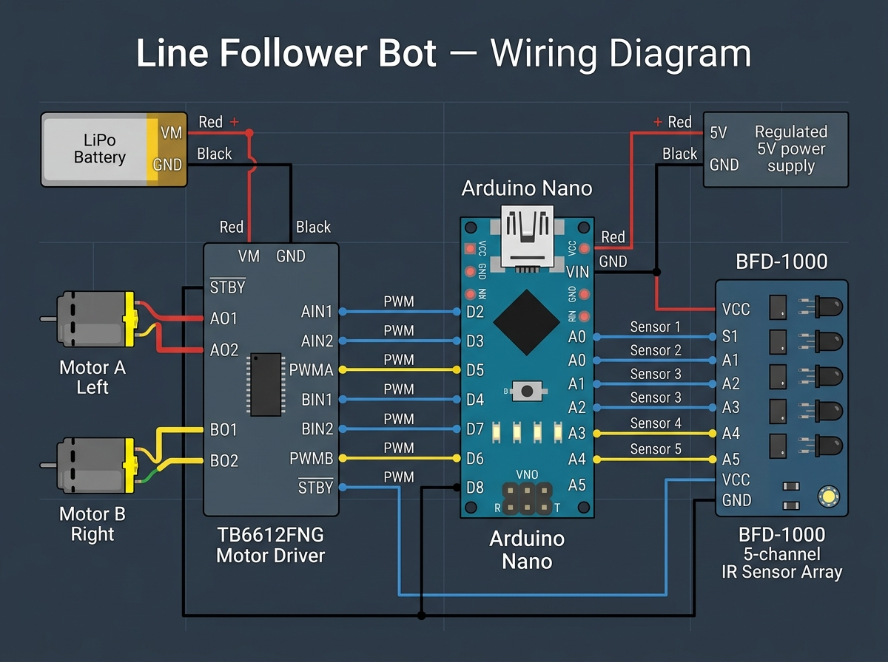

<div align="center">

# Line Follower Bot

**A competition-grade autonomous line following robot driven by a precision PID control algorithm**

[](https://www.arduino.cc/)
[](https://www.arduino.cc/reference/en/)
[](LICENSE)
[]()

<br/>



*The assembled robot — Arduino Nano brain, TB6612FNG dual motor driver, BFD-1000 IR sensor array, and LiPo power pack.*

</div>

---

## 📋 Table of Contents

- [Overview](#-overview)
- [Key Features](#-key-features)
- [Demo](#-demo)
- [System Architecture](#-system-architecture)
- [Hardware](#-hardware)
  - [Components](#components)
  - [Pin Mapping](#pin-mapping)
  - [Wiring Diagram](#wiring-diagram)
  - [PCB Design](#pcb-design)
- [Software](#-software)
  - [Repository Structure](#repository-structure)
  - [Sketch Overview](#sketch-overview)
  - [PID Algorithm](#pid-algorithm)
- [Getting Started](#-getting-started)
  - [Prerequisites](#prerequisites)
  - [Step 1 — Assemble the Hardware](#step-1--assemble-the-hardware)
  - [Step 2 — Install Dependencies](#step-2--install-dependencies)
  - [Step 3 — Calibrate the Sensors](#step-3--calibrate-the-sensors)
  - [Step 4 — Flash the Main Sketch](#step-4--flash-the-main-sketch)
  - [Step 5 — PID Tuning](#step-5--pid-tuning)
- [Tuning Guide](#-tuning-guide)
- [Contributing](#-contributing)
- [License](#-license)

---

## 🔍 Overview

This project is a **competition-level autonomous line follower robot** built from the ground up on an **Arduino Nano**. It navigates a black line on a white surface using real-time feedback from a **BFD-1000 5-channel IR reflectance sensor array** and corrects its trajectory using a carefully tuned **Proportional–Integral–Derivative (PID) control algorithm** driving two DC motors through a **TB6612FNG dual H-bridge motor driver**.

The bot is built to handle:
- **Sharp turns** — aggressive derivative response to sudden line deviations
- **Straight runs** — fast base speed with minimal oscillation
- **Line-lost recovery** — last-known position heuristic to spin back toward the line
- **Noise immunity** — low-pass filter on the derivative term in the advanced implementation

The custom PCB keeps the build compact and competition-ready.

---

## ✨ Key Features

| Feature | Detail |
|---|---|
| **PID Control** | Full P, I, D implementation with configurable gains |
| **8-Sensor Support** | QTR analog sensor array for fine-grained line position |
| **Auto-Calibration** | Sweeps 450 readings at startup — no manual intervention |
| **Line-Lost Recovery** | Spins toward last-known side when line disappears |
| **Derivative LPF** | Low-pass filter on derivative prevents noise spikes |
| **Integral Windup Guard** | Integral clamped to ±200 to prevent runaway |
| **Bidirectional Motors** | Full forward/reverse PWM control per motor |
| **Serial Debug Output** | Live position, error, and motor speed via Serial Monitor |
| **Custom PCB** | Compact single-board layout (jsPDF-exported design) |
| **Modular Codebase** | Separate sketches for testing, calibration, and production |

---

## Demo

> **[▶ Watch the Line Follower Bot in action](media/demo/LFB_demonstration.mp4)**

The demonstration video shows the robot following a closed-loop track at full competition speed, handling both tight corners and straight sections.


---

## System Architecture



### Control Loop (100 Hz)

```
Sensor Read → Position Estimate → Error Calculation
    → PID Compute → Motor Speed Correction → Drive Motors
    → (repeat every ~10 ms)
```

---

## Hardware

### Components

| Component | Model | Purpose |
|---|---|---|
| Microcontroller | **Arduino Nano** (ATmega328P) | Central processing |
| Motor Driver | **TB6612FNG** | Dual H-bridge, 1.2 A continuous per channel |
| IR Sensor Array | **BFD-1000** (5-channel) | Line detection — analog digital output |
| Motors | N20 / TT DC gear motors ×2 | Drive wheels |
| Power | LiPo battery pack | Main power supply |
| Voltage Reg | 5V step-down module | Logic level power |
| Chassis | Custom acrylic / PCB base | Structural support |
| Wheels | Rubber wheels ×2 | Traction |

### Pin Mapping

#### Motor Driver → Arduino Nano

| TB6612FNG Pin | Arduino Pin | Description |
|---|---|---|
| AIN1 | D2 | Motor A direction 1 |
| AIN2 | D3 | Motor A direction 2 |
| PWMA | D5 (PWM) | Motor A speed |
| BIN1 | D4 | Motor B direction 1 |
| BIN2 | D7 | Motor B direction 2 |
| PWMB | D6 (PWM) | Motor B speed |
| STBY | D8 | Standby (drive HIGH to enable) |

#### IR Sensor Array → Arduino Nano

| BFD-1000 Channel | Arduino Pin | Position |
|---|---|---|
| S1 | A0 | Leftmost |
| S2 | A1 | Left-center |
| S3 | A2 | Center |
| S4 | A3 | Right-center |
| S5 | A4 | Rightmost |

> **8-sensor variant** (`pid8_code.ino`): Uses A0–A7 for full QTR analog array, emitter pin on D12.

### Wiring Diagram



### PCB Design

The custom PCB consolidates the Arduino Nano, TB6612FNG motor driver, and supporting passives onto a single board, reducing wiring complexity and improving reliability.

📄 **[View PCB Design PDF](hardware/pcb/LFB_PCB_design.pdf)**

- **Board dimensions:** 588.53 × 655.99 pt (EasyEDA / jsPDF export)
- **Design tool:** EasyEDA → exported as PDF
- **Key features:** Compact layout, through-hole motor connectors, direct sensor header, dedicated power input

---

## Software

### Repository Structure

```
LineFollower-main/
│
├── README.md                          ← You are here
├── LICENSE                            ← MIT License
├── .gitignore                         ← Ignores build artifacts & IDE caches
├── CONTRIBUTING.md                    ← How to contribute
│
├── src/
│   ├── main/
│   │   ├── pid8_code.ino              ← ★ PRIMARY — 8-sensor QTR + full PID
│   │   ├── lineFollowerPIDimplementation.ino  ← Advanced PID w/ LPF + line-lost
│   │   └── decisionMakerLineFollower.ino      ← Decision-tree hybrid approach
│   ├── calibration/
│   │   └── BFDcalibration.ino         ← BFD-1000 standalone calibration tool
│   └── tests/
│       ├── bothMotorTest.ino           ← Test both motors simultaneously
│       └── singleMotorTest.ino         ← Test a single motor
│
├── hardware/
│   └── pcb/
│       └── LFB_PCB_design.pdf         ← Custom PCB layout
│
├── docs/
│   └── wiring/
│       └── wiring_diagram.jpg         ← Full wiring reference
│
└── media/
    ├── demo/
    │   └── LFB_demonstration.mp4      ← Competition demonstration video
    └── photos/
        └── robot_photo.jpeg           ← Physical robot photograph
```

### Sketch Overview

| Sketch | Sensors | Key Characteristics | Use When |
|---|---|---|---|
| [`pid8_code.ino`](src/main/pid8_code.ino) | 8× QTR analog | Auto-calibration, full Serial debug, QTRSensors library | **Primary competition sketch** |
| [`lineFollowerPIDimplementation.ino`](src/main/lineFollowerPIDimplementation.ino) | 5× BFD-1000 digital | 100 Hz loop, derivative LPF, integral clamp, line-lost recovery | Advanced alternative |
| [`decisionMakerLineFollower.ino`](src/main/decisionMakerLineFollower.ino) | 8× QTR analog | Hybrid: decision logic + PID, per-sensor adaptive thresholds | Intersection handling |
| [`BFDcalibration.ino`](src/calibration/BFDcalibration.ino) | 5× BFD-1000 | CLP trigger, button calibration, sensor readout | Sensor setup & verification |
| [`bothMotorTest.ino`](src/tests/bothMotorTest.ino) | None | Drives both motors forward at fixed speed | Hardware assembly check |
| [`singleMotorTest.ino`](src/tests/singleMotorTest.ino) | None | Drives one motor forward | Wiring verification per motor |

### PID Algorithm

The core control equation is:

```
correction = Kp × error + Ki × ∫error·dt + Kd × d(error)/dt
```

Where:
- **error** = `measured_position − 3500` (center of 8-sensor array at 0–7000 scale)
- **Kp** (Proportional) — immediate response to displacement from center
- **Ki** (Integral) — corrects persistent steady-state offset
- **Kd** (Derivative) — damps oscillation and improves response to fast changes

#### Tuned Parameters (Production — `pid8_code.ino`)

```cpp
float kp = 0.092;
float ki = 0.01;
float kd = 0.8;
int   baseSpeed = 120;  // 0–255
```

#### Motor Speed Computation

```cpp
int leftSpeed  = baseSpeed + correction;
int rightSpeed = baseSpeed - correction;
// Both constrained to [-255, +255]
```

When `correction > 0` (line is right of center): left motor speeds up, right slows → bot turns right.

#### Advanced Features (in `lineFollowerPIDimplementation.ino`)

```cpp
// Derivative Low-Pass Filter — reduces noise-induced spikes
float dFilt = kdLPF * deriv + (1.0 - kdLPF) * dFilt;

// Integral Anti-Windup
integ = constrain(integ, -integLimit, +integLimit);

// Line-Lost Recovery — slow turn toward last-known side
int base = lost ? BASE_SPEED / 2 : BASE_SPEED;
```

---

## 🚀 Getting Started

### Prerequisites

- **Arduino IDE** ≥ 1.8.x or **Arduino IDE 2.x**
- **QTRSensors library** by Pololu (required for `pid8_code.ino` and `decisionMakerLineFollower.ino`)
- USB-A to Mini-USB cable (for Arduino Nano)
- Assembled hardware (see [Components](#components))

### Step 1 — Assemble the Hardware

1. Mount motors to the chassis, connect to TB6612FNG output terminals (AO1/AO2 for left, BO1/BO2 for right).
2. Wire TB6612FNG control pins to Arduino Nano per the [Pin Mapping](#pin-mapping) table.
3. Connect BFD-1000 sensor array: S1→A0, S2→A1, S3→A2, S4→A3, S5→A4. VCC→5V, GND→GND.
4. Connect LiPo battery to TB6612FNG VM and GND.
5. Supply regulated 5V to Arduino Nano VIN.
6. Verify all connections against the [wiring diagram](#wiring-diagram).

> Double-check motor polarity — if a motor spins backwards, swap its two output wires at the driver terminal.

### Step 2 — Install Dependencies

1. Open **Arduino IDE**.
2. Go to **Sketch → Include Library → Manage Libraries**.
3. Search for `QTRSensors` by Pololu and install it.

### Step 3 — Calibrate the Sensors

Flash `src/calibration/BFDcalibration.ino` and open the **Serial Monitor** at **9600 baud**:

```
Auto calibrating...
Calibration complete.
Sensors: 0 0 1 0 0
```

Move the sensor array slowly across the track (both on the line and off the line) during calibration. The built-in LED lights up during calibration in the main sketches.

### Step 4 — Flash the Main Sketch

1. Open `src/main/pid8_code.ino` in Arduino IDE.
2. Select **Board**: Arduino Nano, **Processor**: ATmega328P (Old Bootloader if needed).
3. Select the correct **COM Port**.
4. Click **Upload**.
5. After upload, the bot will auto-calibrate for ~9 seconds (450 samples × 20 ms), then start following the line.

> 💡 Place the robot on the track **before** powering up so calibration captures valid min/max values from both the line and the surface.

### Step 5 — PID Tuning

Open the **Serial Monitor** at **9600 baud** to observe live values:

```
Pos: 3512  Err: 12  L: 122  R: 118
```

Use these readings to inform PID adjustments (see [Tuning Guide](#-tuning-guide)).

---

## 🎛 Tuning Guide

PID tuning is iterative. Start from zero and build up:

| Step | Action | Symptom Fixed |
|---|---|---|
| 1 | Increase **Kp** until the bot oscillates | Bot drifts on straight sections |
| 2 | Reduce **Kp** slightly to eliminate oscillation | Oscillating side-to-side |
| 3 | Increase **Kd** to dampen sharp turns | Overshooting corners |
| 4 | Add small **Ki** (≤ 0.05) if the bot drifts over time | Slow drift accumulates |
| 5 | Increase **baseSpeed** once stable | Too slow |

**Signs of good tuning:**
- Straight sections: minimal wobble, full speed
- Turns: smooth arc, no overshoot
- After corners: quickly returns to center without oscillation

**Common problems:**

| Symptom | Likely Cause | Fix |
|---|---|---|
| Rapid side-to-side wiggle | Kp too high or Kd too low | Reduce Kp, increase Kd |
| Slow to correct from offset | Kp too low | Increase Kp |
| Drifts gradually | Ki too low or zero | Add small Ki |
| Spins out on corners | baseSpeed too high | Reduce baseSpeed |
| Stops responding | Integral windup | Reduce Ki or add integral clamp |

---

## 🤝 Contributing

Contributions are welcome! See [CONTRIBUTING.md](CONTRIBUTING.md) for guidelines on opening issues, submitting pull requests, and code style.

---

## 📄 License

This project is licensed under the **MIT License** — see the [LICENSE](LICENSE) file for details.

---

## Acknowledgement
Thanks [Drakren](https://github.com/Drakren) for the hardware architecture, schematics and the PCB design

---

<div align="center">

**Built with ❤️ for robotics competitions**

*If this project helped you, please consider giving it a ⭐ on GitHub!*

</div>
